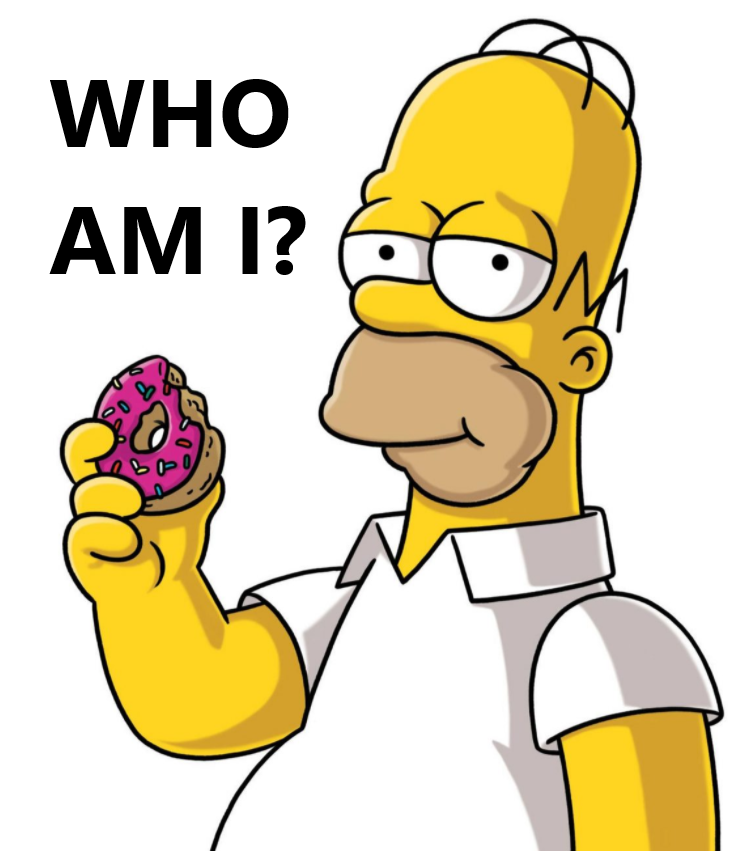

# Simpsons Classifier 

## Written in FastAI PyTorch

This program takes a dataset of Simpsons characters and classifies them.  This is a CNN with transfer learning from ResNet50 written in FastAI PyTorch.  The dataset was procured from Kaggle at https://www.kaggle.com/alexattia/the-simpsons-characters-dataset

For information on FastAI, check out fast.ai 
If you would like to learn FastAI, check out their course at https://course.fast.ai/ and access the free notebooks at https://github.com/fastai/fastbook
